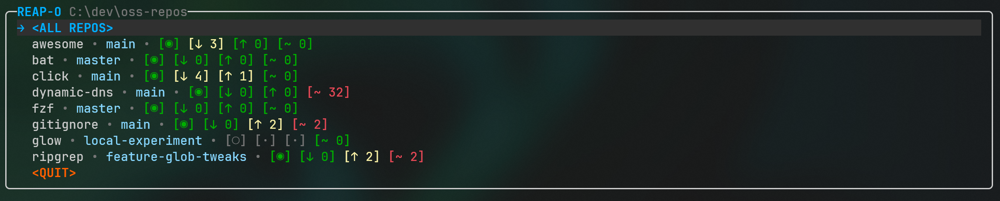
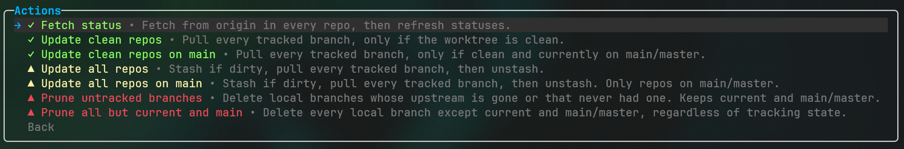
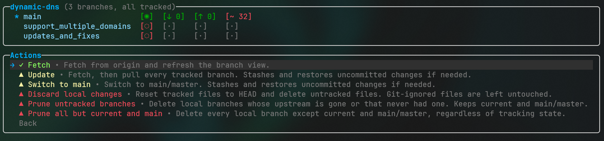

# Reap-O

[](https://github.com/balazs-kis/reapo/actions?query=workflow%3A%22build-and-test%22)
[](https://codecov.io/gh/balazs-kis/reapo)
[](https://opensource.org/licenses/MIT)
[](https://github.com/balazs-kis/reapo/fork)

An interactive terminal tool for managing a folder full of git repositories. Point it at a
directory, and it discovers the git repos inside and lets you fetch, update, and prune branches
across all of them or one at a time.





## Usage

```
reapo <path>
```

`<path>` is the directory containing your git repositories.

Navigate with the arrow keys, `Enter` to select, `Esc` to go back. Dangerous actions ask for
confirmation. `Ctrl-C` cancels the current action; press it twice to quit.

## Actions

**All repos**
- **Fetch status** — fetch from origin everywhere, then refresh the list.
- **Update clean repos** — pull every tracked branch, skipping any repo with a dirty worktree.
- **Update all repos** — stash if dirty, pull every tracked branch, then unstash.
- **Update clean / all repos on main** — as above, limited to repos currently on `main`/`master`.
- **Prune untracked branches** — delete local branches whose upstream is gone or never existed.
- **Prune all but current and main** — delete every local branch except the current one and `main`/`master`.

**Single repo** — Fetch, Update, Switch to main, Discard local changes, and the two Prune actions above.

- **Switch to main** — switch to `main`/`master`, stashing and restoring uncommitted changes if needed.

Prune actions always keep the current branch and `main`/`master`.

## Requirements

- .NET 10 SDK
- `git` on your `PATH`

## Demo

https://github.com/user-attachments/assets/c488c790-d1eb-47d0-826a-5ebdf5aa8a61

